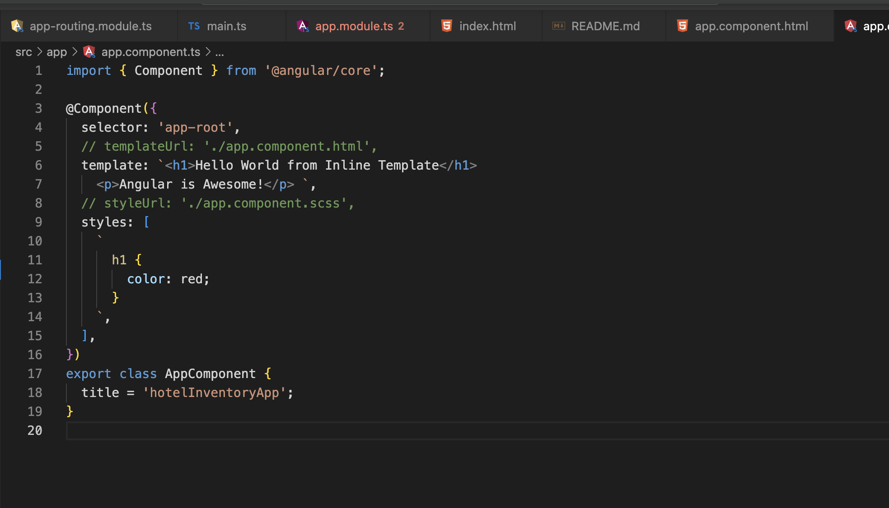

**RootModule (AppModule.Ts)**

```

We must have only one rootModule, for SPA rendering.In Angular this is the App Module.

My AppModule Classs is the root module of my application

It contains the following

(a)Information about all components in my angular
(b)It contains information of all third party liblaries in use.


@NgModule({})
export class AppModule { }

contains informartion about different modules and components being used.


What NgModule does:

(a)It gives my compiler information about all the modules i am using.

bootstap under NgModule gives the first component that is going to be rendered.

```

**Basic Component Structure**



```
Notice, @Component decoractor, i can add my stlyes and HTML Seperately or inline.

Decorator adds some extra properties in the Class.

```

**Component Rendering**

```
Only one component is going to be rendered in the end.
All the other components are rendered inside the root/ main component.


```

**There are three ways of Component Data Binding**

```
(a)Interpolation
(b)Property Binding

(Various properties are available in different HTML Tags)

(We can assign value of HTML propertues directly)
(Instead of calling them by ID, we just bind to the values of the properties directly)
(Angular can be able to work with all the elements that are present in JavaScript and we should be
able to bind to them directly)

We can use property binding with any Valid HTML propery.

(c)Event Binding

How i can be able to fire events, or pass data from my HTML to my JavaScript
```

**Angular Directives**

```
(a)Directives are used to change the behaviour and apperance of DOM Elements.
(b)Directives can implement life cycle hooks
(c)The difference between directives and components is that directives cannot have HTML.

Types of directives:

(a)Structural Directives.
(Can be able to Modify the DOM)
(Costiler because they change behaviour of DOM)
(They are attributed by a *(*ngIf, *ngFor, *ngSwitch )

(b)Attribute Directives.

They can Modify DOM eg style but cannot add or remove elements from DOM
(ngClass and ngStyle)

ngClass - I append my class name.
ngStyle - I write the styles directly.

```

**Angular Pipes**

```
They are used for Data Transformation.
They do not change the actual Object
The original Object remains the same, but when i am presenting it i am presenting it
in a slightly different format.

Angular has a number of built in pipes.

(a)Date Pipe
<td>{{ room.checkInTime | date : "dd/MMM/yyyy" }}</td>

```

**Bootstrap Installation**

```
ng add ngx-bootstrap
npm install bootstrap --save

we can cofnfiugure using style.scss or angular.json
```

**Component Life Cycle Hooks**

```
First and foremost these life cycle methods are interfaces,thus we must implement them.

Component instance has lifecycle hooks, which help us hook into different events
on components.

A constctutor is called before the lifecycle hooks. a constctutor is required for
instantiating the component.

Once component is instantiated.we can hook into various life cycle methods.
Constructors should howeve not have any blocking code, that code should be on NgOnInit.

LifeCycle ends when a component is destroyed.

(a)ngOnChanges

Change Detection
Whenever we do an action example delete item in a table, the DOM needs to be updated by angular
This is where change detection comes in.

Angular change detection is more efficieent when we use ngOnChanges.
Only the components which need to change are going to change.

There are two types of change detection:

(a)Default() ->any even will cause an entire change detection for your application.

(b)OnPush() -->Works when data is coming externally (for instance, i am sure that my
component relies of data from an external call)

(b)ngOnInit

Once a component has been initialized and for instance we want to call an API,We should
do that under ngOnInit.

(c)ngDoCheck
(d)ngAfterContentInit
(e)ngAfterContentChecked
(f)ngAfterViewInit
(g)ngAfterViewChecked
(h)ngOnDestroy

```

**Component Communication**

```
Scenerio where two or more components need to interact is known as Component communication.

There are various ways in which component communication happens:

(a)Using @Input and @OutPut.
A parent component passes data to a child component via @Input

(The relationship between th e Components is Parent/Child or Smart/Dump Component)

 <hinv-rooms-list [rooms]="roomList" (selectedRoom)="selectRoom($event)" ></hinv-rooms-list>

This pariculat comppoent is taking it data via properyBinding and is also emitting an
event.

When a child needs to commuicate with the Parent,we use @OutPut, which is an event emitter.

(b) Using @ViewChild and @ContentChild
(c)Using Services.

```
